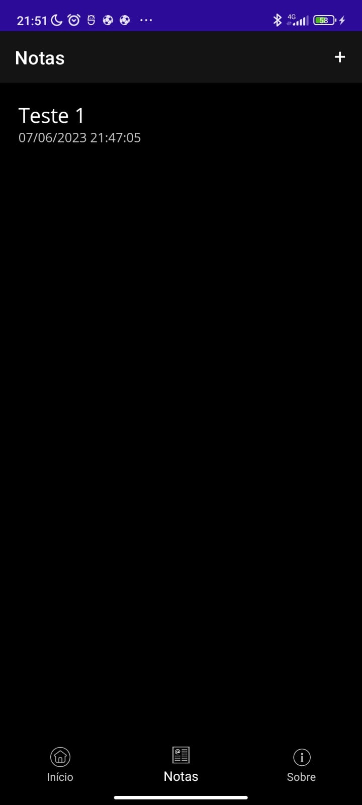
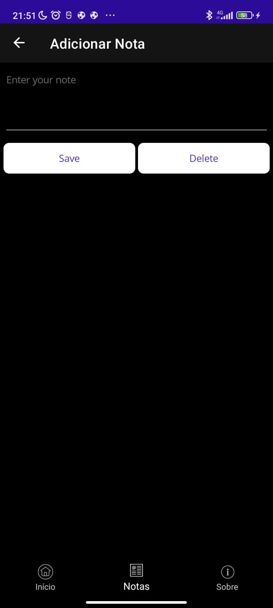

# 📝 | Notes
Projeto de Notas feito em .NET MAUI na aula de PdAMI (Programação de Aplicativos Mobile I), Aprendemos a utilizar Data e multi páginas.

## ⚙️ | Funcionamento

  

## ☕ | Linguagem utilizada

  <h3 align="left">.NET MAUI</h3>

## 🌎 | Links

[Link do projeto da Microsoft](https://learn.microsoft.com/en-us/dotnet/maui/tutorials/notes-app/?tutorial-step=1)
